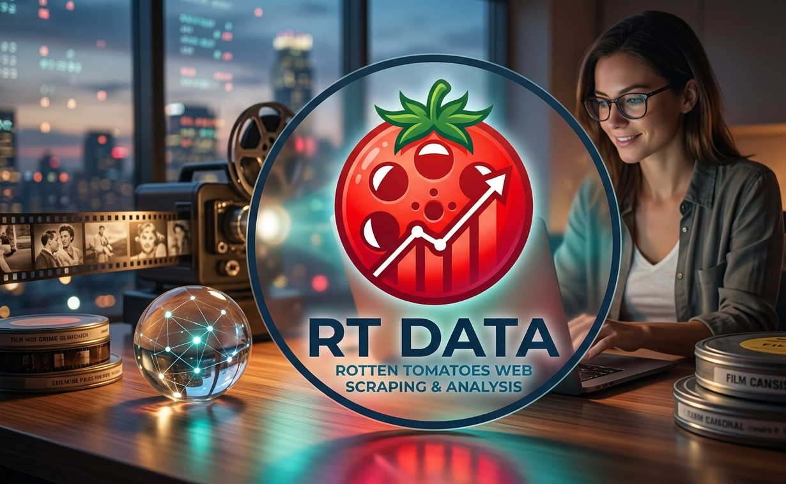

# 🍅 Rotten Tomatoes Web Scraper & Dataset Analyzer
<p align="center">
  
</p>

[](https://www.python.org/)
[](https://www.selenium.dev/)
[](https://pandas.pydata.org/)
[]()

---

## 📌 Project Overview

This project is a end-to-end data pipeline built in Python to extract, clean, process, and analyze movie data from **Rotten Tomatoes**.

Using **Selenium**, the scraper navigates through web controls, handles dynamic custom elements (Shadow DOM), accepts cookie consent popups, and scrapes **1,500+ records** spanning across multiple paginated search results. The scraped dataset is then cleaned, imputed, categorized, and analyzed using **Pandas**, **NumPy**, **Matplotlib**, and **Seaborn**.

---

## ✨ Key Features & Capabilities

* 🕵️ **Dynamic Web Scraping:** Uses Selenium WebDriver to interact with live UI elements, search boxes, pagination buttons, and cookie banners.
* 🌑 **Shadow DOM Extraction:** Extracts embedded metadata like production release years, critics scores, and cast lists located inside Custom Web Components / Shadow Roots using JavaScript execution.
* 🧹 **Data Cleaning & Imputation:** Handles missing values across dataset attributes using standard techniques (e.g., median score imputation).
* 📊 **Categorization & Analytics:** Converts raw text metric scores (`%`) into numerical values and categorizes movie performance (`HIT (>=75%)` vs `Below Average (<60%)`).
* 📁 **Automated Export:** Exports the clean dataset into a structured CSV file (`rotten_tomatoes_movies.csv`).

---

## 🛠️ Tech Stack & Dependencies

* **Language:** Python 3.x
* **Browser Automation:** `selenium`
* **Data Manipulation:** `pandas`, `numpy`
* **Visualization:** `matplotlib`, `seaborn`
* **Environment:** Jupyter Notebook / Google Colab

---

## 📂 Dataset Schema

The output dataset (`rotten_tomatoes_movies.csv`) contains the following schema:

| Column Name | Data Type | Description |
| :--- | :--- | :--- |
| `Title` | String | Title of the movie / media item |
| `Year` | String / Int | Release year (e.g., `2026`, `2001`) |
| `Critics_Score` | String | Original critics percentage score on Rotten Tomatoes |
| `Cast` | String | Top cast members (or `Unknown` if missing) |
| `Image_Link` | String | URL pointer to the thumbnail image poster |
| `Score_Numeric` | Float | Clean numerical representation of critics score |
| `Score_Category`| Categorical| Classified metric grade (`HIT (>=75%)`, `Below Average (<60%)`, etc.) |

---

## 🚀 Step-by-Step Workflow

### 1. Browser Initialization & Cookie Acceptance
```python
from selenium import webdriver
from selenium.webdriver.chrome.options import Options
from selenium.webdriver.common.by import By
from selenium.webdriver.support.ui import WebDriverWait
from selenium.webdriver.support import expected_conditions as EC

options = Options()
options.add_argument("--start-maximized")
driver = webdriver.Chrome(options=options)

# Navigate to URL & accept cookies
driver.get('[https://www.rottentomatoes.com/](https://www.rottentomatoes.com/)')
button = WebDriverWait(driver, 10).until(
    EC.element_to_be_clickable((By.ID, "onetrust-accept-btn-handler"))
)
button.click()
```
### 2. Load & Analyze Scraped Dataset
```python
import pandas as pd
import numpy as np
import matplotlib.pyplot as plt
import seaborn as sns

# Load the scraped data from the repository
df = pd.read_csv('rotten_tomatoes_700.csv')

# Display basic dataset summary
print(f"Total Rows Scraped: {len(df)}")
df.head() 
```
---

### ⭐ Support

If you found this project helpful, please consider giving it a **Star** ⭐️ on GitHub!
